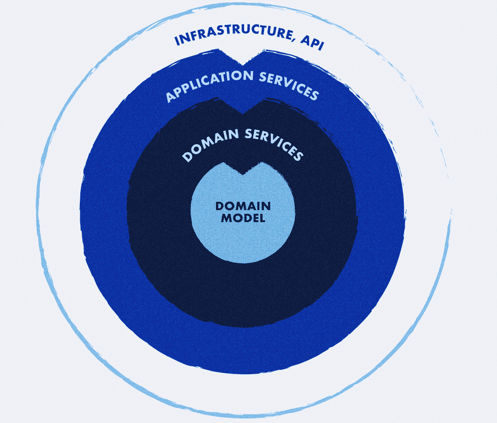

# Demo: Domain-Driven Design, Onion Architecture & CQRS

This project is a **demonstration of a modern backend architecture** built around:

* **Domain-Driven Design (DDD)**
* **Onion Architecture** (aka Hexagonal / Clean Architecture)
* **CQRS (Command Query Responsibility Segregation)**

The goal of the project is to show how these concepts can be applied together in a real-world–like application, while keeping the codebase clean, testable, and independent from infrastructure concerns.

---

## Key Features

* Clear separation of **Domain**, **Application**, and **Infrastructure** layers
* **CQRS** with explicit Commands and Queries
* Parallel data persistence:

    * Relational database
    * **Elasticsearch** for search and read models
* Asynchronous event publishing via **RabbitMQ**
* High testability:

    * All three layers are covered by tests
    * **No external dependencies are required to run tests**
* Infrastructure is fully containerized with **Docker**
  * API Documentation available via Swagger: [http://127.0.0.1:9501/api/doc.json](http://127.0.0.1:9501/api/doc.json)

---

## Architecture

The project follows **Onion Architecture**, where the core business logic is isolated from external concerns.

The main idea is based on the **Inversion of Control** principle:
**Domain and Application layers are at the center**, while infrastructure details are pushed to the outer layers.



### Layers Overview

* **Domain**

    * Pure business logic
    * Entities, Value Objects, Aggregates
    * Domain services and interfaces
    * ❗ No dependencies on frameworks or infrastructure

* **Application**

    * Use cases (Commands & Queries)
    * Orchestrates domain logic
    * Defines ports (interfaces) for infrastructure

* **Infrastructure**

    * Technical implementations
    * Database, Elasticsearch, RabbitMQ
    * Framework- and vendor-specific code

---

## CQRS

* **Commands**

    * Change system state
    * Use synchronous transport

* **Queries**

    * Read-only operations
    * Use synchronous transport

Command and query models are intentionally separated to keep responsibilities clear and scalable.

---

## Rules & Conventions

* Domain layer contains **only abstractions and business logic**
* Application layer coordinates domain and infrastructure
* Infrastructure layer contains **only implementations**
* No infrastructure dependencies inside the Domain
* All changes **must be covered by tests**
* Prefer **unit tests** over integration tests
* ❗ Pull requests with **less than 70% test coverage will be rejected**

---

## Requirements

* Docker

---

## Installation

Start all services:

```bash
make up
```

---

## Usage

### Enter a container

```bash
make bash container=container-name
```

### Monitor service logs

```bash
make logs service=service-name
```

### Stop a service

```bash
make stop service=service-name
```

### Start a service

```bash
make start service=service-name
```

### Build all services

```bash
make build
```

### Build a specific service

```bash
make build service=service-name
```

### Run a specific service

```bash
make up service=service-name
```

### Show running containers status

```bash
make status
```

### Get help

```bash
make help
```

---

## Testing

* All layers are covered by tests
* Tests can be executed **without running databases, Elasticsearch, or RabbitMQ**
* The project is designed to be easily testable and CI-friendly

---

## Purpose of This Project

This repository is intended for:

* Demonstrating best practices in DDD and Clean Architecture
* Serving as a reference for structuring complex backend systems
* Experimenting with CQRS, messaging, and search synchronization

It is **not** a framework, but a practical example you can learn from or adapt to your own projects.

## License

This project is licensed under the **MIT License**.

See the [LICENSE](LICENSE) file for details.